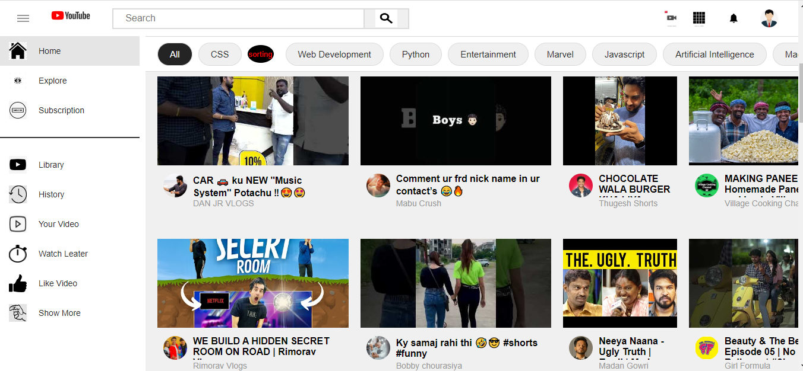
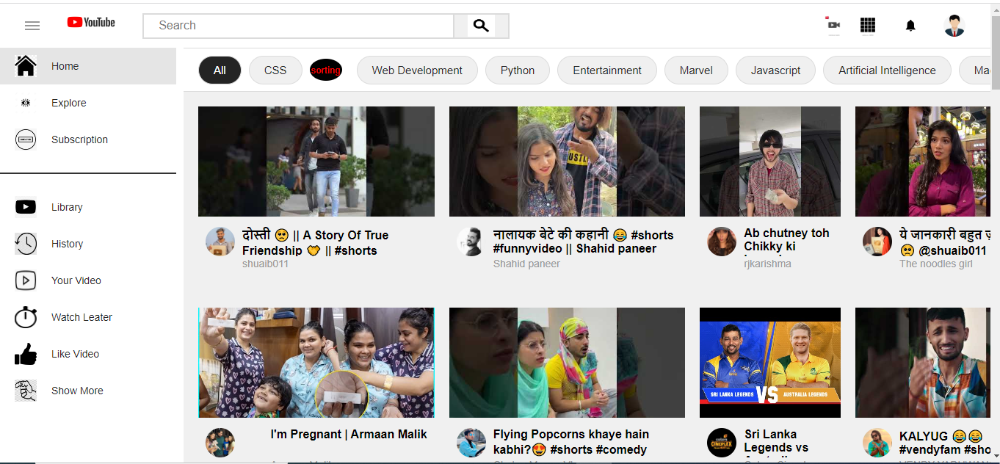

# Youtube+ Clone

YouTube is a video sharing service where users can watch, like, share, comment and upload their own videos. The video service can be accessed on PCs, laptops, tablets and via mobile phones

## Deployment

To deploy this project run

```bash
 github - Deployment -https://kunalchandel4.github.io/You-Tube-Clone/
```


## Tech Stack

- HTML 5
- CSS 
- JavaScript
- You Tube APi


## Features
- sorting Functionality on particular ID
- Search
- To View The certain Vedio refer to Orgin www.youtube.com


## Teams
- Varainder Brar 
- Sonia Saini
- Kunal Chandel
- Rajiv Suting
- Rajeev Awasti 
## Screenshots



